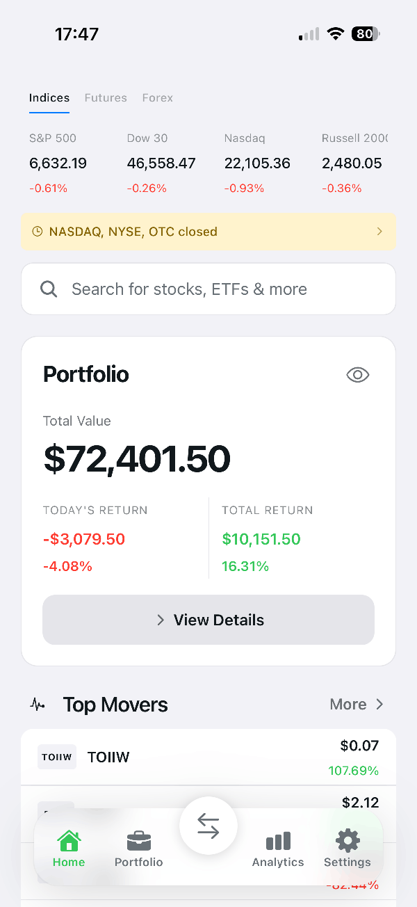
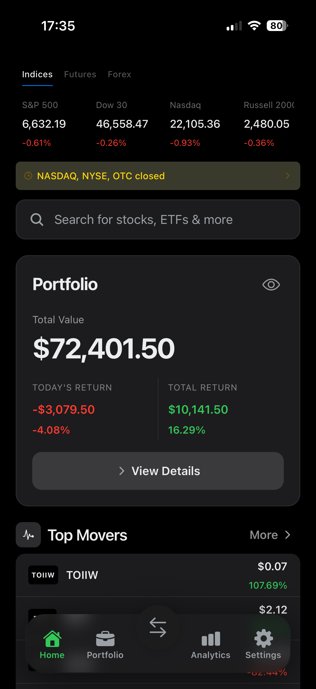
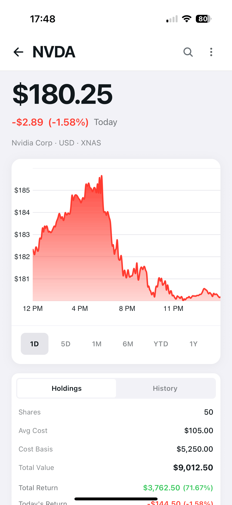
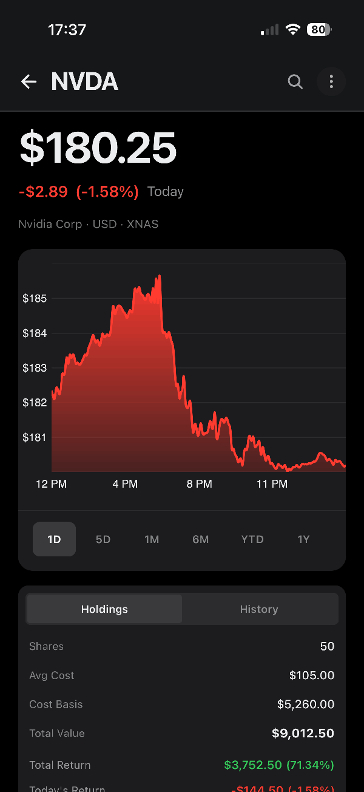
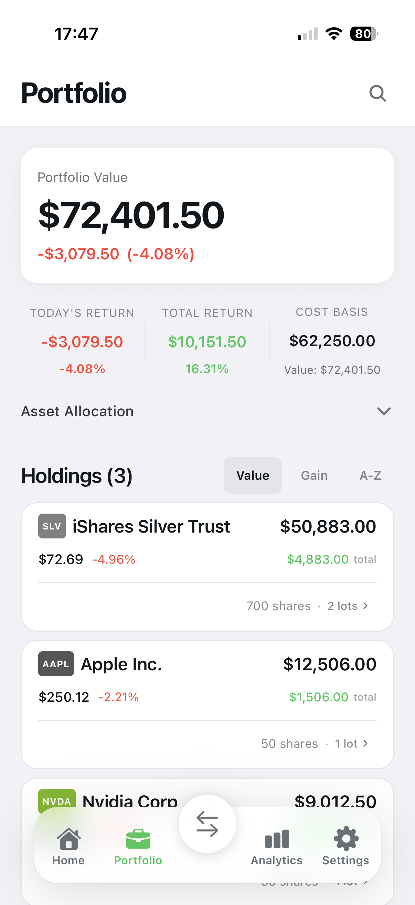
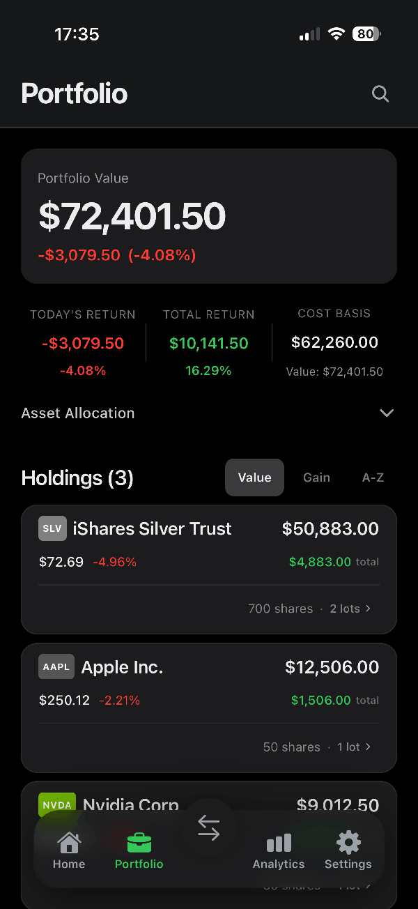
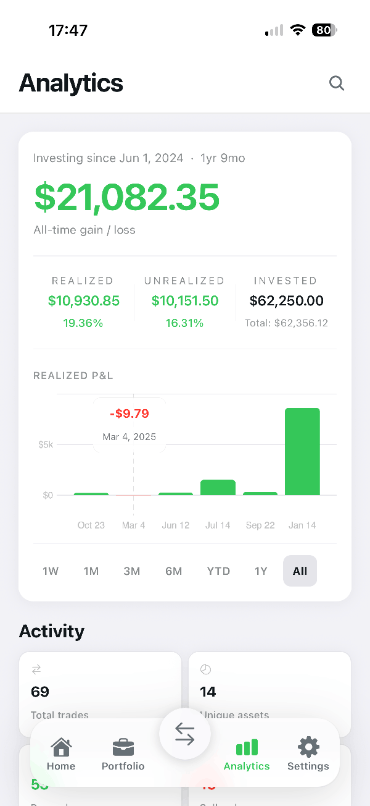
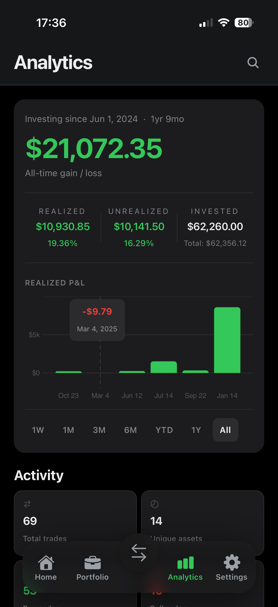
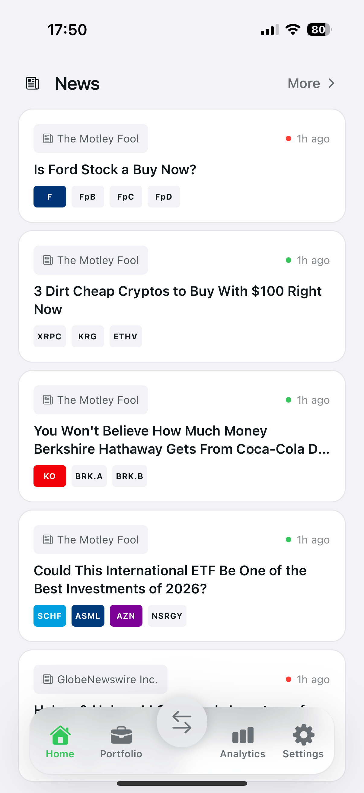
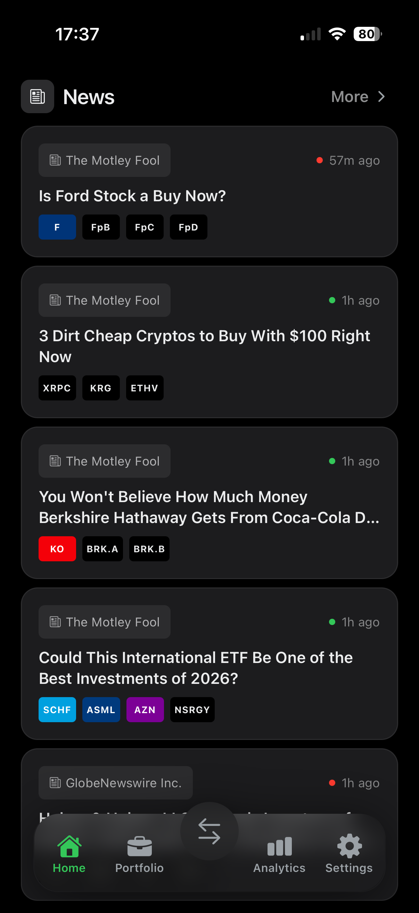

# Finance 2049

  <a href="https://github.com/LukaGiorgadze/finance2049">🗃️ Finance 2049 App Repository</a>

  
  

  
<strong>Open more screenshots</strong>

   

  

    
    
  

  

    
    
  

  

    
    
  

  

    
    
  

---

Simple, open-source portfolio tracking app for long-term investors.

Finance 2049 helps you clearly understand how much you invested, how your portfolio performs over time, and what you actually earned — without trading noise, subscriptions, or complex tools.

## Why Finance 2049

Most finance apps are built as full investing platforms with busy interfaces and unnecessary features for long-term investors.  
Others are simple but too limited and do not provide essential portfolio analytics.

Finance 2049 is built in the middle — calm, simple, but complete.

## Features

- Portfolio value and total return tracking  
- Cost basis and invested capital visibility  
- Realized and unrealized gains separation  
- Transaction and lot history  
- Performance analytics  
- Import transactions from `.xlsx`, `.json`, `.pdf`, images and more  
- Export full portfolio data anytime  
- Local-first storage (your data stays on your device)  
- Fully open-source and transparent  

## Not a trading app

Finance 2049 does not support buying or selling assets.  
It is designed purely for portfolio tracking and performance understanding.

## Data & Privacy

All portfolio data is stored locally on your device.  
No subscriptions. No hidden tracking. Full control.

## Status

Early stage project. Feedback and contributions are welcome.
